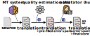
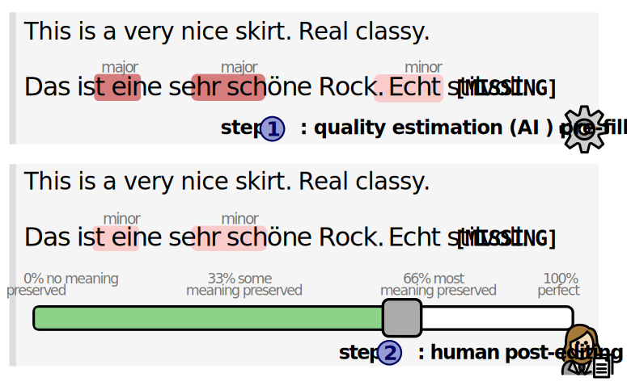
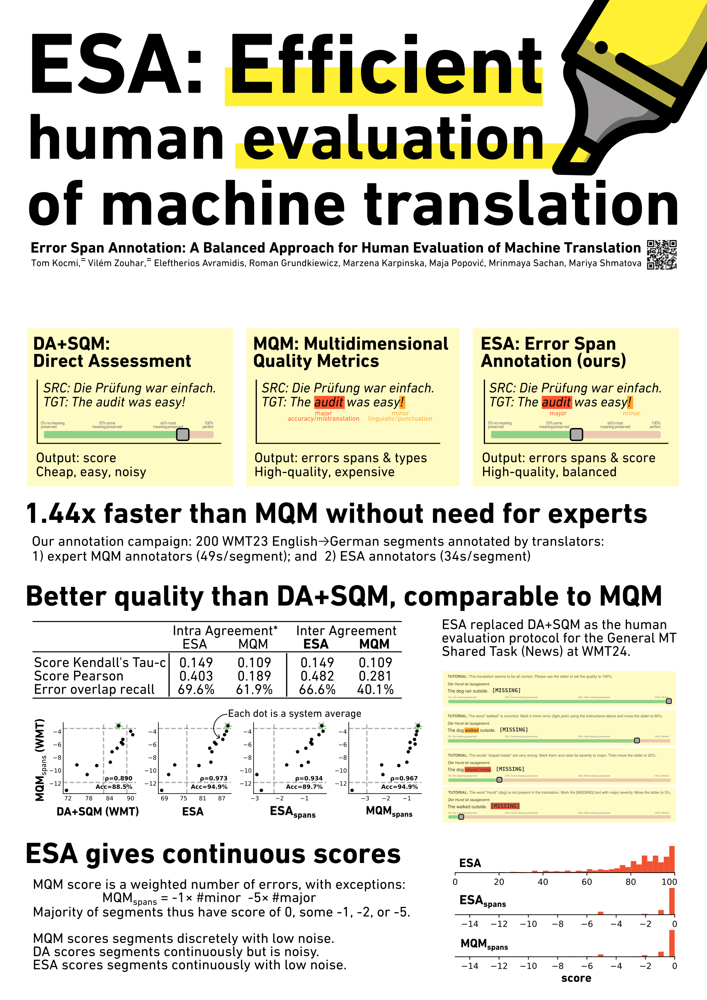

# Error Span Annotation

This repository contains the analysis of Error Span Annotations (ESA) and ESA<super>AI</super> which are human protocols for machine translation evaluation.
The protocols themselves are implemented in [Appraise](https://github.com/AppraiseDev/Appraise).

> **ESA** <br>
> **TL;DR:** New annotation protocol is faster than MQM, does not require experts, and is higher quality than DA. <br>
> **Abstract:** High-quality Machine Translation (MT) evaluation relies heavily on human judgments. Comprehensive error classification methods, such as Multidimensional Quality Metrics (MQM), are expensive as they are time-consuming and can only be done by experts, whose availability may be limited especially for low-resource languages. On the other hand, just assigning overall scores, like Direct Assessment (DA), is simpler and faster and can be done by translators of any level, but are less reliable. In this paper, we introduce Error Span Annotation (ESA), a human evaluation protocol which combines the continuous rating of DA with the high-level error severity span marking of MQM. We validate ESA by comparing it to MQM and DA for 12 MT systems and one human reference translation (English to German) from WMT23. The results show that ESA offers faster and cheaper annotations than MQM at the same quality level, without the requirement of expensive MQM experts.

> **ESA<super>AI<super>** <br>
> **TL;DR:** AI-assisted human evaluation of MT decreases annotation costs while keeping the quality high. <br>
> **Abstract:** Annually, research teams spend large amounts of money to evaluate the quality of machine translation systems (WMT, Kocmi et al 2023, 2024 inter alia). This is expensive because it requires a lot of expert human labor. The recently adopted annotation protocol, Error Span Annotation (ESA), has annotators marking erroneous parts of the translation and then assigning a final score. A lot of the annotator time is spent on scanning the translation for possible errors. In our work, we help the annotators by pre-filling the error annotations with recall-oriented automatic quality estimation. With this AI assistance, we obtain annotations at the same quality level while cutting down the time per span annotation by half (71s/error span 31s/error span). The biggest advantage of ESA protocol is an accurate priming of annotators (pre-filled error spans) before they assign the final score. This also alleviates a potential automation bias, which we confirm to be low. In addition, the annotation budget can be reduced by almost 25% with filtering of examples that the AI deems to be very likely to be correct.





## Code & Data

In order to run the scripts, you need to "install" the package with:
```
pip3 install -e .
```

Then just run scripts from `scripts/` and `ESA/`.
The collected data is in `data/`, though it we recommend using the loader such as:
```python
from ESA.annotation_loader import AnnotationLoader
df = AnnotationLoader(refresh_cache=False).get_view(["ESA-1", "ESA-2", "MQM-1", "MQM-2", "ESAAI-1", "ESAAI-2"], only_overlap=False).dropna()
```

## Cite

Read [ESA](https://aclanthology.org/2024.wmt-1.131/) and [ESAAI](https://arxiv.org/abs/2406.12419) papers.
If you use Error Span Annotation protocol, please cite:

```
@inproceedings{kocmi-etal-2024-error,
    title = "Error Span Annotation: A Balanced Approach for Human Evaluation of Machine Translation",
    author = "Kocmi, Tom and Zouhar, Vil{\'e}m and Avramidis, Eleftherios and Grundkiewicz, Roman and Karpinska, Marzena and Popovi{\'c}, Maja and Sachan, Mrinmaya and Shmatova, Mariya",
    editor = "Haddow, Barry and Kocmi, Tom and Koehn, Philipp and Monz, Christof",
    booktitle = "Proceedings of the Ninth Conference on Machine Translation",
    month = nov,
    year = "2024",
    address = "Miami, Florida, USA",
    publisher = "Association for Computational Linguistics",
    url = "https://aclanthology.org/2024.wmt-1.131/",
    doi = "10.18653/v1/2024.wmt-1.131",
    pages = "1440--1453",
}

```

and

```
@misc{zouharkocmi2024esaai,
      title={AI-Assisted Human Evaluation of Machine Translation}, 
      author={Vilém Zouhar and Tom Kocmi and Mrinmaya Sachan},
      year={2024},
      eprint={2406.12419},
      archivePrefix={arXiv},
      primaryClass={cs.CL},
      url={https://arxiv.org/abs/2406.12419}, 
}
```




## Running the ESA/ESA<super>AI</super> interface

The ESA interface was implemented in [https://github.com/AppraiseDev/Appraise](Appraise).

```
# set up Appraise basics
git clone https://github.com/AppraiseDev/Appraise
git checkout develop
cd Appraise
pip3 install -r requirements.txt

# some Appraise stuff
python3 manage.py migrate;
DJANGO_SUPERUSER_USERNAME=test DJANGO_SUPERUSER_PASSWORD=test python3 manage.py createsuperuser --noinput --email "test@test.test";
python3 manage.py collectstatic --no-post-process;

# add the default ESA campaign
python3 manage.py StartNewCampaign Examples/MQM+ESA/manifest_esa.json \
    --batches-json Examples/MQM+ESA/batches_esa.json \
    --csv-output Examples/MQM+ESA/output_esa.csv;

# launch the server!
python3 manage.py runserver;

# keep it running but navigate to some of the links in Examples/MQM+ESA/output_esa.csv

# after everyone finishes, collect the data with the following command:
python3 manage.py ExportSystemScoresToCSV example15esa
```